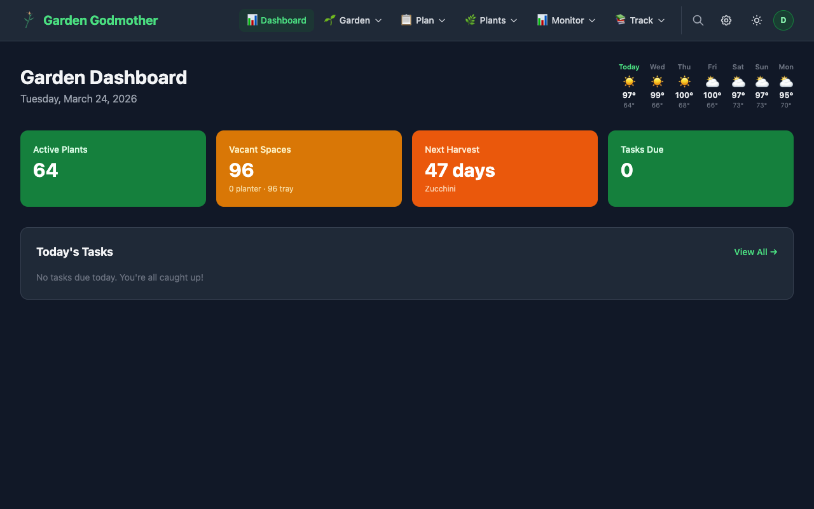
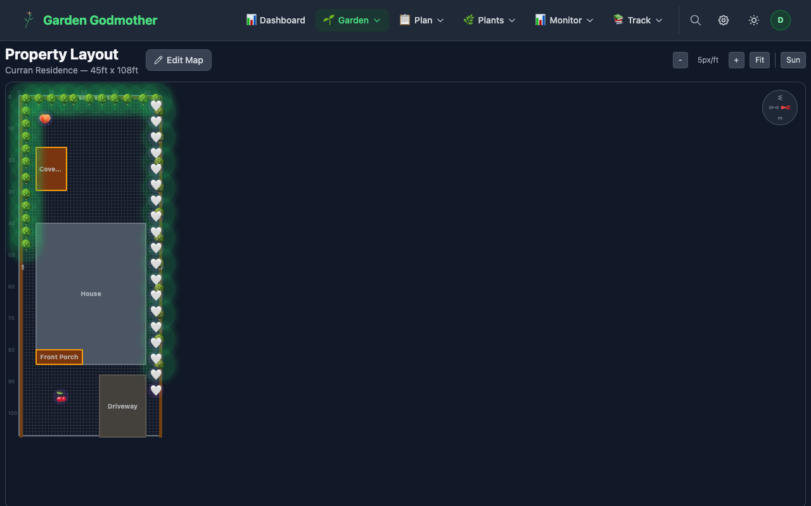
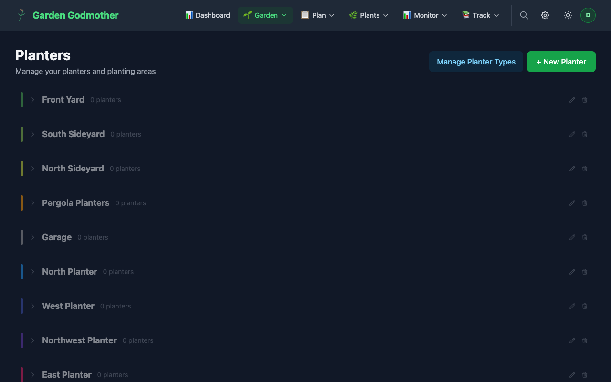
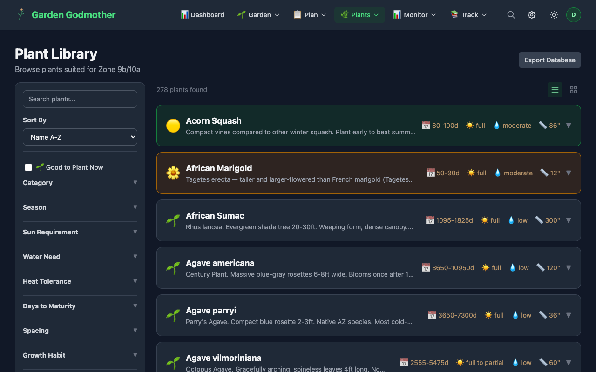
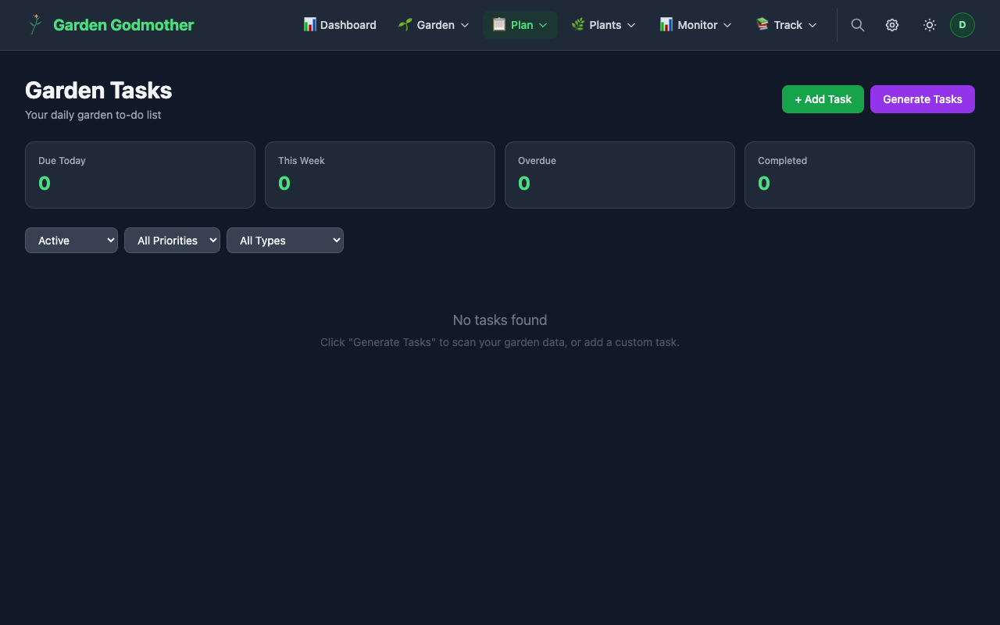
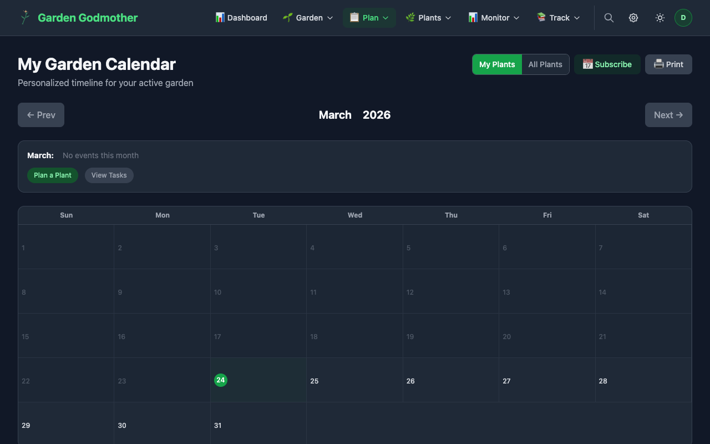
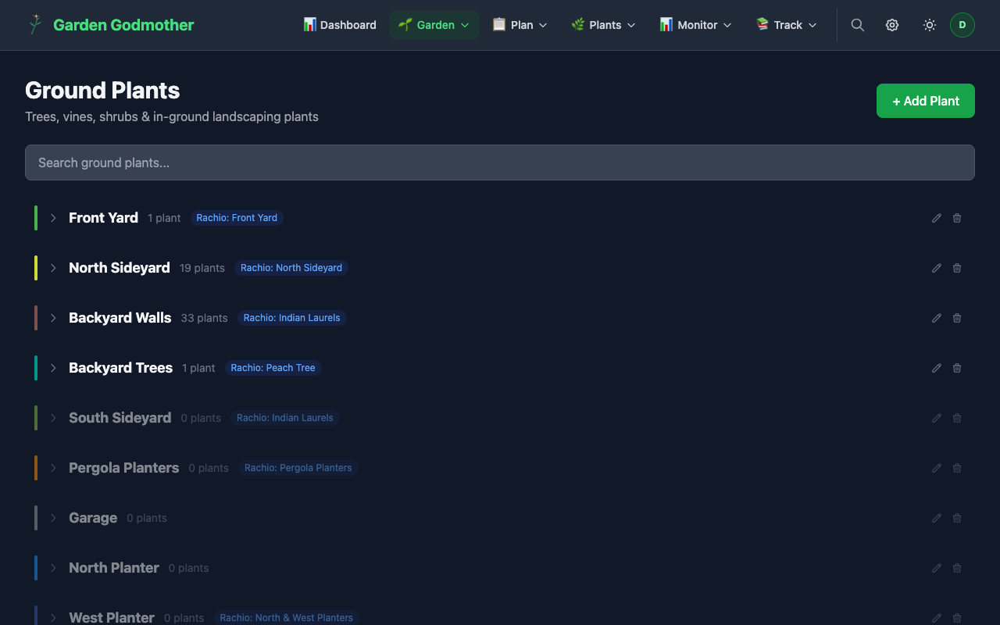
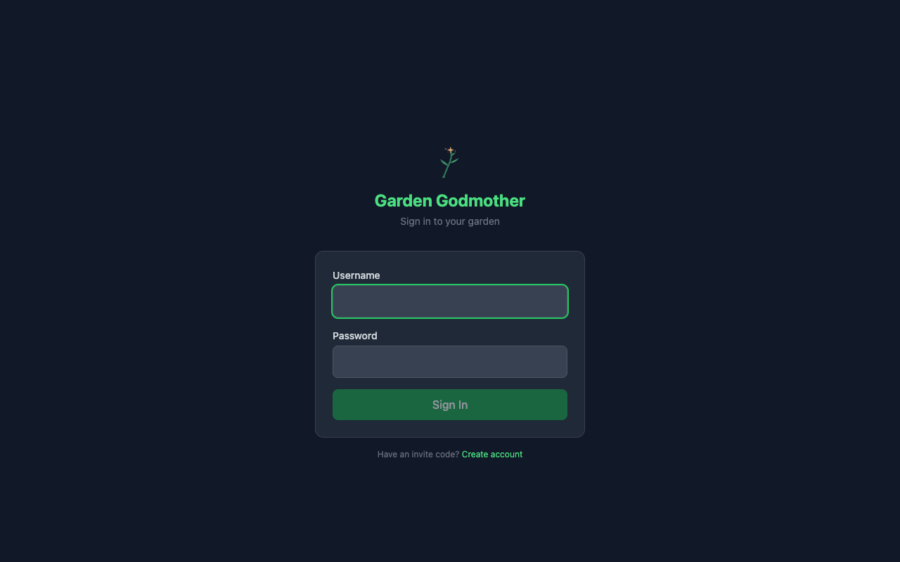

# 🌱 Garden Godmother

**Self-hosted garden management for any climate.**

Plan, plant, and maintain your garden with smart automation, AI-powered health monitoring, and beautiful visualizations. Runs on a Raspberry Pi.



---

## Features

### 🗺️ Garden Management
- **Property map editor** — sun tracking, shadow calculations, drag-and-drop placement
- **Planter grids** — raised beds, vertical planters, containers, freeform layouts
- **Seed tray tracking** — cell-level management with germination and transplant tracking
- **Ground plants** — trees, vines, shrubs with dedicated detail pages
- **Area organization** — group plants by location, auto-assign from map position




### 🌿 Plant Intelligence
- **273+ plants** with companion planting data and desert/climate ratings
- **354 varieties** with cultivar-specific growing information
- **1,156 companion relationships** — know what grows well together
- **AI photo analysis** — GPT-4o vision identifies plants and diagnoses health issues
- **Plant health monitoring** — batch photo analysis with automatic alerts



### 📋 Planning & Tasks
- **Smart task generation** — 10 watering rules factoring soil, sun, container, season, and weather forecast
- **Weather-aware scheduling** — multi-day forecast checks, heat wave prep, frost protection, wind adjustments
- **Lifecycle planner** — seed-to-harvest waterfall with cascading task dependencies
- **Garden bed templates** — one-click planting plans (Salsa Garden, Three Sisters, Pizza Garden, Herb Garden, Pollinator, Desert Salad Bowl)
- **Monthly calendar** with zone-appropriate planting windows
- **iCal subscription feeds** — 5 event types, subscribe from any calendar app




### 📊 Monitoring & Weather
- **Multiple weather providers** — Tempest WeatherFlow, Open-Meteo (free), OpenWeatherMap, NWS
- **Home Assistant integration** — map any HA sensor entity to a role (temperature, humidity, soil moisture, etc.)
- **Rachio smart irrigation** — controller zones and hose timer valve support, water usage tracking
- **7-day forecast** on the dashboard with weather-emoji icons
- **Frost alerts** — auto-generates protection tasks when temps drop below 40°F
- **Harvest tracking** with upcoming harvest countdown and yield analytics

### 🤖 AI Features
- **Plant health monitoring** — scheduled GPT-4o photo analysis with health status dashboard
- **Journal AI summaries** — weekly/monthly garden recaps summarizing activity, harvests, and tasks
- **Photo analysis** — snap a photo, get plant ID, health assessment, and care recommendations

### 👥 Multi-User
- **Session-based auth** with Argon2id password hashing
- **Invite code registration** — admins generate codes, users sign up
- **Role-based access** — admin, user, viewer
- **Shared garden** — everyone collaborates on the same garden with user attribution
- **Audit logging** — who changed what and when

### 🔔 Notifications
- **4 channels**: Email (SMTP), Discord (webhook), Web Push (PWA), Pushbullet
- **Per-user preferences** — event type × channel matrix
- **6 event types**: task due, task overdue, harvest ready, frost warning, plant health alert, invite accepted

### 🏗️ Infrastructure
- **Docker Compose** — runs on Raspberry Pi 4/5, any Linux server, or cloud VM
- **SQLite** with 38 numbered migrations (safe, never re-run)
- **Hourly backups** with 14-day retention + pre-deploy snapshots
- **Auto-update system** — pull from GitHub, configurable schedule, web UI control
- **PWA support** — install on iOS/Android home screen
- **Onboarding wizard** — guided first-time setup
- **Configurable integrations** — no hardcoded API keys, everything from the admin UI

---

## Tech Stack

| Layer | Technology |
|---|---|
| Frontend | Next.js 14, Tailwind CSS, TypeScript |
| Backend | Python FastAPI, SQLite |
| Auth | Session cookies, Argon2id |
| AI | OpenAI GPT-4o / GPT-4o-mini |
| Deployment | Docker Compose |

---

## Quick Start

```bash
git clone https://github.com/rancur/garden-godmother.git
cd garden-godmother
cp .env.example .env
docker compose up -d --build
```

Visit `http://localhost:3400` — the onboarding wizard will guide you through setup.

Default admin credentials are logged on first startup — check `docker logs garden-api`.

---

## Configuration

### Integrations (configured in the app UI)

After starting the app, go to **Settings > Integrations** to connect your services:

| Integration | What it does | API key needed? |
|---|---|---|
| **Rachio Controller** | Smart irrigation zones | Yes (from rachio.com) |
| **Rachio Hose Timer** | Smart hose timer valves | Uses Rachio key |
| **Tempest WeatherFlow** | Personal weather station data | Yes (from tempestwx.com) |
| **Open-Meteo** | Free weather forecasts | No — just works |
| **OpenWeatherMap** | Weather data | Yes (free tier available) |
| **Home Assistant** | Sensor data (soil moisture, etc.) | Long-lived access token |
| **OpenAI** | AI photo analysis + journal summaries | Yes (from platform.openai.com) |
| **OpenPlantBook** | Plant species enrichment | Yes (from open.plantbook.io) |

No API keys in config files — everything stored securely in the database and managed from the admin UI.

### Environment Variables (deployment only)

These are only needed for container/network configuration, not integrations:

```bash
# Production — customize for your domain
CORS_ORIGINS=https://garden.yourdomain.com    # Allowed origins (default: http://localhost:3400)
COOKIE_DOMAIN=.yourdomain.com                  # Cookie sharing across subdomains
NEXT_PUBLIC_API_URL=https://api.yourdomain.com # API URL for the browser (default: http://localhost:3402)

# Optional — can also be set via Settings > Integrations
OPENAI_API_KEY=           # Pre-configure OpenAI at startup
HA_TOKEN=                 # Pre-configure Home Assistant at startup
HA_URL=                   # Home Assistant URL (default: http://homeassistant.local:8123)
```

For local development, the defaults work out of the box — no `.env` changes needed.

---

## Architecture

```
Browser → garden-web (Next.js :3400) → garden-api (FastAPI :3402) → SQLite
```

| Service | Description | Port |
|---|---|---|
| `garden-web` | Next.js frontend | 3400 |
| `garden-api` | FastAPI backend (25+ modules) | 3402 |

- **Database**: SQLite, persisted via Docker volume
- **Backups**: Hourly snapshots, 14-day retention
- **HTTPS**: Via Cloudflare Tunnel, Caddy, nginx, or any reverse proxy

---

## Screenshots

| | |
|---|---|
|  |  |
| Dashboard with weather forecast | Property map with sun tracking |
|  |  |
| Plant library (273+ species) | Monthly planting calendar |
|  |  |
| Smart task management | Ground plant areas |
|  |  |
| Clean login page | Planter management |

---

## Contributing

See [CONTRIBUTING.md](CONTRIBUTING.md) for development setup, code style, and PR guidelines.

- **Feature ideas** → [New Issue](../../issues/new?template=feature_request.md)
- **Bug reports** → [New Issue](../../issues/new?template=bug_report.md)
- **Rough ideas** → [New Issue](../../issues/new?template=idea.md)

---

## License

[MIT](LICENSE)
